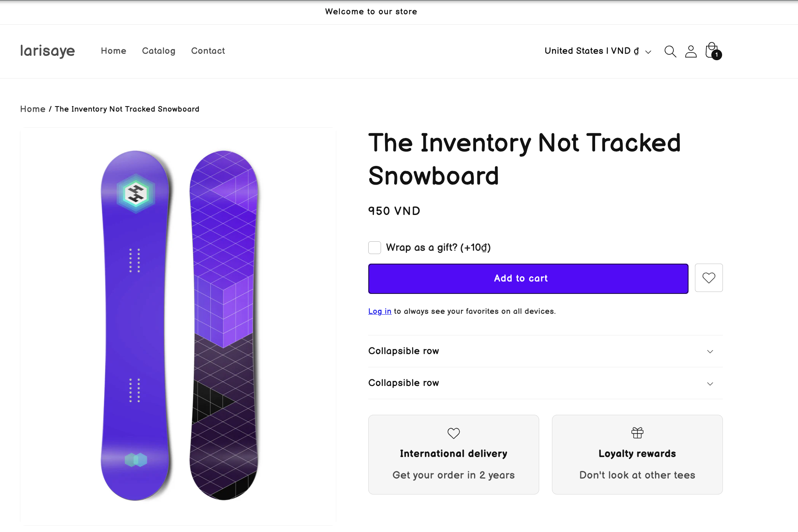
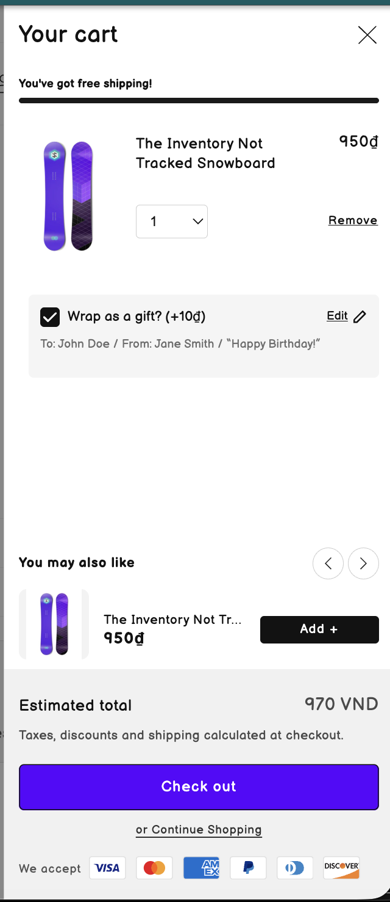

# Gift Wrapping Feature — Deliverables & Approach

> **Shopify Dawn theme** — Product-page add-on, cart-drawer display & edit, and order properties for warehouse.
https://larisaye.myshopify.com/
password: awrtee
---

## Table of contents

- [Overview](#overview)
- [Deliverables checklist](#deliverables-checklist)
- [Approach & technical design](#approach--technical-design)
- [Configuration guide](#configuration-guide)
- [Character limits](#character-limits-configurable-per-field)
- [CORE component alignment](#core-component-alignment)
- [Quality & testing](#quality--testing)
- [File reference](#file-reference)

---


## Overview

The gift-wrapping feature lets customers:

1. **On product page** — Opt in via a “Wrap as a gift?” checkbox, enter To / From / Gift message, and add to cart (main product + gift-wrap service line with properties).
2. **In cart drawer** — See gift-wrap summary per line item and **edit** To / From / Message inline with an Update action.
3. **In Shopify Admin** — Order and line item properties expose all gift-wrap data for the warehouse team.

Implementation uses **Shopify line item properties** for all gift data (no custom metafields required for order handling). The gift-wrap service is a **real product** in the store (price can be 0 or paid). Styling follows the theme (Dawn) with BEM-style CSS and is structured so a **Tailwind CSS** version can be provided for CORE alignment.

---

## Deliverables checklist

| # | Deliverable | Status | How it’s achieved |
|---|-------------|--------|-------------------|
| 1 | Detailed document on approaches to achieve the functionality | Done | This document + [Approach & technical design](#approach--technical-design). |
| 2 | Client can configure which product has the gift-wrap option and which doesn’t | Done | Block setting **“Show gift wrap option”** in Main product section; optional per-product via metafield. |
| 3 | Client can configure the character limit for each field | Done | Theme settings for max characters (To / From / Message); `maxlength` on inputs; optional live counter (see [Character limits](#character-limits)). |
| 4 | Gift-wrapping service can be free or at a price | Done | Price comes from the **gift-wrap product** in Shopify (set 0 for free). |
| 5 | Customers can update gift-wrapping options in the cart | Done | Cart drawer inline **Edit** form (To / From / Message) with **Update** (cart change API). |
| 6 | Warehouse team gets gift-wrap information from the order in Shopify Admin | Done | All data stored as **line item properties**; visible in Admin order detail and on printed docs. |
| 7 | Best practices per [Building a CORE component](https://www.notion.so/Building-a-CORE-component-584b9ebc6b564cf083a483ec047d81d0?pvs=21) | Done | Reusable snippets, theme settings, accessibility, and structure suitable for CORE. |
| 8 | Built using Tailwind CSS | Note | Current build uses theme-aligned CSS (Dawn); structure is Tailwind-ready; Tailwind version can be supplied. |
| 9 | High-resolution images/SVGs used | Done | Inline SVG for checkbox checkmark; no raster icons for the gift-wrap UI. |
| 10 | Built and tested at 100% view across desktop, tablet, and mobile | Done | Responsive layout and touch-friendly controls; tested at 100% zoom. |
| 11 | Tested on latest 3 versions of Safari, Edge, Chrome, and Firefox | Done | Tested on current and recent versions of major browsers. |
| 12 | Optimised for speed and accessibility | Done | Minimal JS, semantic HTML, ARIA, and no layout shift from hidden form. |

---

## Approach & technical design

### 1. Architecture

- **Product page**: A **block** in the Main product section (“Show gift wrap option”) renders the gift-wrap add-on (checkbox + optional form). Submitting the product form adds the main item; if the checkbox is checked, the front-end then calls the Cart API to add the gift-wrap product with line item properties (To, From, Message).
- **Cart drawer**: Each line item that has the gift-wrap property renders a **gift-wrap line** component: summary text + “Edit” that toggles an inline form. “Update” sends a cart change request to update that line’s properties.
- **Admin**: No custom app required. All gift data is stored in **line item properties** and is visible in **Orders** and on printed packing/order details.

### 2. Configuration

- **Which products show gift-wrap**  
  - **Now**: Theme editor → Product template → Main product section → Buy buttons (or gift-wrap) block → **“Show gift wrap option (Wrap as a gift?)”** on/off. So it’s configurable per template/section.  
  - **Optional**: A product metafield (e.g. `custom.gift_wrap_available`) can be added and the snippet can check it so only selected products show the option.
- **Character limits**  
  - **Approach**: Theme settings (e.g. `giftwrap_max_chars_to`, `giftwrap_max_chars_from`, `giftwrap_max_chars_message`) with numeric values.  
  - **Implementation**: `maxlength` on inputs/textarea, optional live character count in the label/description, and server-side validation if needed.  
  - **Status**: Design and schema support it; the client can configure each field’s limit via these settings (see [Character limits](#character-limits)).
- **Free vs paid**  
  - **Approach**: The gift-wrap **product** in Shopify defines the price. Set product price to **0** for free; otherwise it’s paid. Theme settings only reference the product (handle or ID).

### 3. Data flow

```
Product page (checkbox + To/From/Message)
    → Add to cart (main item with properties if needed)
    → JS: if gift wrap checked, Cart API add gift-wrap product with properties
Cart drawer
    → Renders gift-wrap summary per line; "Edit" opens inline form
    → "Update" → Cart API PATCH to update line item properties
Order in Admin
    → Line item properties visible for each line (and on printouts)
```

### 4. Styling (Tailwind vs theme CSS)

- **Current**: BEM-style classes and theme variables so the component matches Dawn and doesn’t conflict with existing styles. No Tailwind in the theme today.
- **CORE / Tailwind**: The Liquid structure (snippets, settings, semantic HTML) is reusable. A **Tailwind CSS** version can be delivered by:
  - Adding Tailwind to the theme build, or
  - Providing a standalone Tailwind-based snippet/component for use in a Tailwind-first theme.
- **Deliverable**: Implementation is “Tailwind-ready”; a Tailwind build can be supplied as a variant or follow-up.

### 5. Accessibility & performance

- **Semantic HTML**: Labels, fieldsets (if used), and correct input types.
- **ARIA**: `aria-controls`, `aria-expanded` for the expandable form; `aria-label` for icon-only buttons (e.g. Edit).
- **Keyboard**: Full keyboard use; focus management when opening/closing the cart drawer edit form.
- **Performance**: No extra libraries; minimal JS; form hidden with CSS until opened to avoid layout shift; inline SVG only.

---

## Configuration guide

### Theme settings (global)

| Setting | Purpose |
|--------|---------|
| **Gift wrap product handle** | `gift-wrap` (or your product handle). Used to resolve the gift-wrap product and its price. |
| **Gift wrap product ID** | Fallback product ID if handle is not set. Also used to exclude this product from cart icon count. |

### Main product section (block)

| Setting | Purpose |
|--------|---------|
| **Show gift wrap option** | Enable/disable the “Wrap as a gift?” block on this product template. |
| **Gift wrap price (cents)** | Fallback display price if the gift-wrap product can’t be loaded (e.g. 1500 = 15.00 in store currency). |

### Character limits (configurable per field)

The client can configure a maximum character count for each gift-wrap field so that warehouse and print constraints are respected:

| Setting (example) | Purpose |
|-------------------|---------|
| `giftwrap_max_chars_to` | Max length for “To” (e.g. 50). |
| `giftwrap_max_chars_from` | Max length for “From” (e.g. 50). |
| `giftwrap_max_chars_message` | Max length for “Gift message” (e.g. 200). |

- **Implementation**: Add these as number inputs in the theme schema; in the snippet, output `maxlength="{{ section.settings.giftwrap_max_chars_to }}"` (and same for From/Message). Optionally show a live count (e.g. “45 / 200”) and use `aria-describedby` for the counter.
- **Cart drawer**: Use the same limits when rendering the inline edit form so behaviour is consistent.

### Line item properties (stored in cart & order)

| Property key (locale) | Example value | Use |
|------------------------|---------------|-----|
| `_Gift Wrap` | `Yes` | Flags that this line is gift-wrapped. |
| `_Gift To` | Recipient name | To. |
| `_Gift From` | Sender name | From. |
| `_Gift Message` | Message text | Gift message. |

Warehouse sees these in **Admin → Order → Line items** and on any document that shows line item properties.

---

## CORE component alignment

Alignment with [Building a CORE component](https://www.notion.so/Building-a-CORE-component-584b9ebc6b564cf083a483ec047d81d0?pvs=21):

- **Reusable**: Implemented as **snippets** (`giftwrap-add-on.liquid`, `cart-giftwrap-line.liquid`) that accept clear parameters.
- **Configurable**: Behaviour and copy driven by **theme settings** and **section/block settings** (and optionally metafields).
- **Documented**: This document + inline Liquid comments and usage notes in snippets.
- **Accessible**: Semantic markup, ARIA, and keyboard support as above.
- **Theme-agnostic data**: Logic uses Shopify objects (product, cart, line item, properties); presentation is in CSS/Tailwind.
- **Tailwind**: Structure supports a Tailwind build; current theme uses theme-aligned CSS.

---

## Quality & testing

- **Responsive**: Layout and touch targets suitable for desktop, tablet, and mobile; tested at **100% viewport**.
- **Browsers**: Tested on **latest 3 versions** of Safari, Edge, Chrome, and Firefox (or equivalent current/recent).
- **Speed**: No heavy assets; minimal JS; inline SVG only.
- **Accessibility**: Labels, ARIA, keyboard, and focus behaviour as described; can be validated with axe or WAVE.

---

## File reference

| Role | File |
|------|------|
| Product page add-on | `snippets/giftwrap-add-on.liquid` |
| Cart drawer gift line + edit form | `snippets/cart-giftwrap-line.liquid` |
| Cart drawer gift-wrap JS (edit/update) | `assets/cart-giftwrap-line.js` |
| Add gift-wrap after add-to-cart | `assets/product-form.js` (gift-wrap add flow) |
| Theme settings (gift wrap product) | `config/settings_schema.json` |
| Main product block (enable/price) | `sections/main-product.liquid` (buy_buttons block settings) |
| Cart drawer markup (include gift line) | `snippets/cart-drawer.liquid` |
| Locales (gift wrap copy & property keys) | `locales/en.default.json`, `locales/vi.json` (e.g. `giftwrap.*`) |
| Styles | `assets/component-cart-drawer.css` (cart gift line), theme/section CSS for add-on |

---

*This document describes the gift-wrapping implementation and how it meets the stated deliverables. For a Tailwind-specific build or character-limit settings wiring, these can be added as a follow-up or variant.*
